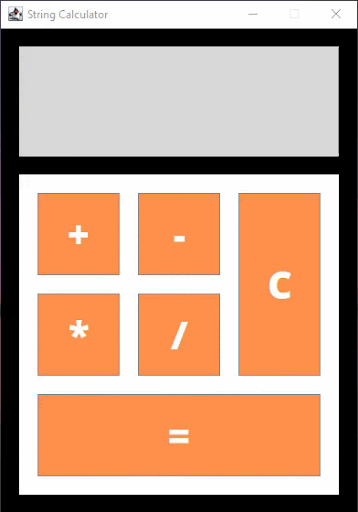

# Event Driven Programming - String Calculator

## Table of contents

- [Overview](#overview)
  - [Screenshot](#screenshot)
- [My process](#my-process)
  - [Built with](#built-with)
  - [What I learned](#what-i-learned)
- [Author](#author)
- [Acknowledgments](#acknowledgments)

## Overview

### Screenshot

#### String Calculator Preview
---

## My process

### Built with

- Java Swing

### What I learned

Learned to implements events handling such as ActionListener, KeyListener, and actionPerformed. This program perform a basic operations on strings, such as concatenation, it also has clear history function. The output displayed in graphical user interface. 

## Author

- Website - [Shanice](https://github.com/sdacleofe/about-me)

## Acknowledgments

I want to express my gratitude to my event-driven programming course instructor for imparting knowledge about the concept of Java GUI to us.

**This laboratory activity was made on March 9, 2022**